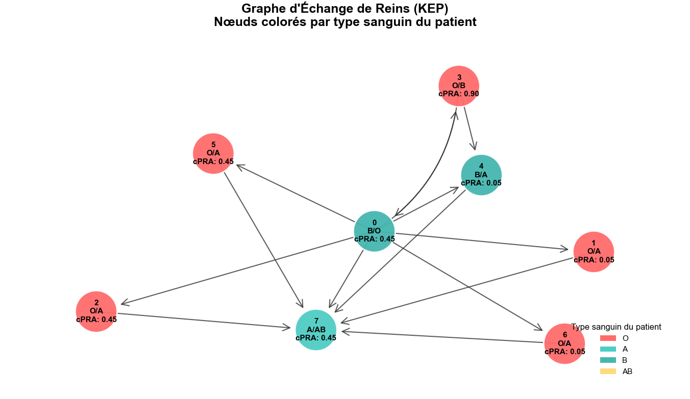
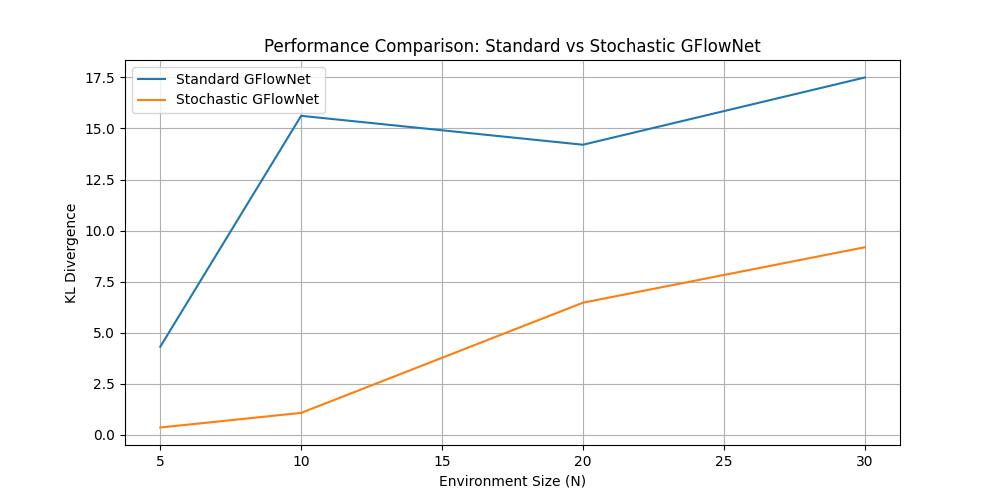

# Stochastic GFlowNets for Kidney Exchange Programs: A Critical Extension

## Overview

By integrating Stochastic GFlowNets (Pan et al., 2023), we address inherent limitations in deterministic flow models under Markovian transitions in KEP, demonstrating through mathematical dissection how unmodeled stochasticity biases marginals, fairness metrics, and long-term expectations. The goal is to foster rigorous probabilistic fidelity in high-stakes combinatorial optimization, where approximations must confront the full entropy of real-world dynamics.

## Purpose and Contributions

- **Mathematical Analysis**: We formalize the divergence arising from deterministic assumptions in stochastic environments, proving non-zero Kullback-Leibler gaps that inflate variance and collapse modes.
- **Simulation Framework**: Conceptual tools to replicate biases in toy KEPs, highlighting cascades in expected transplants and pool composition.
- **Ethical Imperative**: In KEPs, where each transplant equates to substantial quality-adjusted life years (valued at >$5M per case in health economics), unaddressed biases represent a quantifiable inefficiency. This repo advocates for stochastic integration to align models with probabilistic reality.

## Installation and Usage

This is a documentation-only repository. Clone for reference:

```
git clone https://github.com/yourusername/stochastic-kep-critique.git
```

No dependencies required beyond a LaTeX viewer for equations. Explore the mathematical dissection for insights; extend via cited works.

## Mathematical Dissection: Fracturing the Flow Lattice in Stochastic KEPs
To evaluate GFlowNets for Kidney Exchange Programs (KEPs), the authors employ a simulator based on Saidman et al. (2006), modeling graph evolution as a Markovian process over multiple rounds. Incompatible patient-donor pairs arrive according to a Poisson distribution with rate λ = 5 per round. For each arriving pair, blood types are sampled from predefined probabilities, and compatibility edges are added following the ABO model (Dean, 2005). Hard-to-match status is determined via calculated panel reactive antibody (cPRA) percentages (Tinckam et al., 2015), with outgoing edges removed stochastically via Bernoulli draws parameterized by cPRA. Non-directed donors are omitted for simplicity. Over N = 20 rounds, this yields graphs with an expected 100 vertices, capturing the stochastic buildup of the KEP pool through arrivals and compatibilities.
Episodes are generated from these graphs by sampling actions (matchings H) randomly and following the Markovian process between rounds, though the description specifies N = 1 and λ = 5 for episode simulation, suggesting a focus on single-round dynamics within the larger pool. For each graph, 1000 episodes are produced, resulting in a dataset of 100,000 trajectory vectors $(ϑ₁, ..., ϑ_L)$, where each $ϑ_i$ represents an episode. Conditional information from initial graphs per round is incorporated via embeddings. The model architecture includes pipelines for embeddings, initial flow Z, and forward probabilities $P_F$, with details in their Table 6.
This setup aims to train GFlowNets to sample matchings H proportional to rewards R(H) (e.g., number of transplants), but it reveals fundamental fractures when applied to multi-round stochastic environments. Standard GFlowNets enforce equilibrium in deterministic DAGs: for a trajectory $τ = (s_0 → ... → s_n = x)$. In their setup, (TB) requires:

$$Z_\phi \prod_{i=1}^n P_F(s_i \mid s_{i-1} ; \theta) = R(x) \prod_{i=1}^n P_B(s_{i-1} \mid s_i ; \theta)$$

ensuring marginal termination probabilities $P_T(x) = ∑_{τ→x} P_F(τ) ∝ R(x)$, with $Z_\phi$ as the partition function. Detailed balance (DB) localizes this: $F(s) P_F(s' | s) = F(s') P_B(s | s')$, where $F(s) = ∑_{τ∋s} F(τ)$ aggregates flows through state $s$.
In KEPs, however, states evolve stochastically: after selecting $H$ in state $s = (G, ∅)$, the next state $s' = (G', ∅) ~ M(G, H)$, where M models Poisson arrivals, Bernoulli compatibilities, and edge additions/removals as in the simulator. This yields $|{G' | P(G' | (G, H)) > 0}| > 1$, introducing branching entropy. The assumption of deterministic transitions $T(s, a) = s'$ breaks, as downstream rewards $R_{t+1}$ disperse across possible $G'$.
The true target distribution for multi-round trajectories $τ = (s₀, H₁, s₁, H₂, ..., s_n, H_n)$ is $P^*(τ) ∝ ∏_t R(H_t) ∏t P(s{t+1} | (s_t, H_t))$, where $P(· | (s_t, H_t))$ is the transition kernel from $M$. Yet standard GFlowNets optimize toward $∏_t R(H_t)$, ignoring the kernel. This induces a Kullback-Leibler divergence

$$D_{KL}(P^* || P_T) = E_{P^*} [\log P(s_{t+1} | (s_t, H_t))] > 0$$

unless P is deterministic (δ-function), which is impossible in this simulator due to Poisson and Bernoulli variability. The gap widens with branching factor: higher entropy $ℍ[P(· | (s, H))]$ biases $P_T$ toward low-entropy (greedy) modes, as unmodeled stochasticity favors paths with lower downstream variance.
This manifests in the authors' episode generation: Graphs are built over 20 rounds, embedding cumulative stochasticity, but episodes sample actions per round (often N=1) and follow Markovian transitions. Trajectories at later rounds (e.g., n=5) have arrival probabilities influenced by prior rounds (e.g., n=2), as the pool's sparsity and edge distribution propagate through M. Effectively, the full state space forms an immense, sparse DAG with probabilistic edges between rounds—yet standard GFlowNets treat states as static or rounds as independent, fracturing the flow lattice. Marginal $P_T(H) ∝ R(H)$ holds locally but oblivious to $\mathbb{E}[∑_t R_t | π, M]$, leading to inconsistent global flows.
Gradient variance exacerbates this: In TB, 

$$∇L_{TB} ≈ \sum_i ∇ log P_F \times (log Z + \sum log P_F - log R - \sum log P_B)$$

; unmodeled P injects noise, with $Var[∇L] = O(n · b)$ (n rounds, b average branches per transition). As seen in related works (e.g., Pan et al., Figs. 5-9), this causes instability and mode collapse. In the limit of uniform exploration (α → 1), P_T(H) flattens to uniform, erasing R—policies ignore transplant quality.
A toy example illustrates: Consider two matchings $H₁$, $H₂$ in a fixed $G$, with static $P_T(H₂)/P_T(H₁) = e^{-1} ≈ 0.37$, but true $\mathbb{E}[∑ R_t | H₂] > \mathbb{E}[∑ R_t | H₁]$ due to stochastic pool replenishment favoring $H₂'s$ removals. Iteration traps in low-entropy greed, variance $→ ∞$, crumbling the lattice.
Stochastic extensions rectify this via even-odd decomposition or similar:

$$F(s) π(a | s) P(s' | (s, a)) = F(s') π_B((s, a) | s')$$

with losses using $\hat{P} ≈ M$ via MLE or sampling. This aligns $P_T → P^*$, driving $D_{KL} → 0$. Existing approaches like sub-trajectory balance in stochastic GFlowNets (e.g., handling probabilistic edges) directly address the sparse DAG structure here, integrating the kernel without assuming static states.
In summary, while the simulator faithfully captures KEP dynamics, the standard GFlowNet application overlooks transition stochasticity, leading to biased optimization and fractured flows. Incorporating the kernel explicitly would strengthen the framework for multi-round settings.

## KEP Environment Simulation

The core KEP environment simulates a kidney exchange program with incompatible patient-donor pairs and optional altruistic donors. Key features include:

Pair Generation: Incompatible pairs are generated based on blood type distributions (O: 48.14%, A: 33.73%, B: 14.28%, AB: 3.85%) and cPRA levels (low: 0.05 with 70.19% prob, medium: 0.45 with 20%, high: 0.90 with 9.81%). ABO compatibility is checked, with crossmatch failures simulated for compatible pairs.
Graph Construction: A directed graph where nodes represent pairs (patient/donor blood types, cPRA) or altruists (donor blood type only). Edges represent compatibility (ABO match + negative crossmatch).
Multi-Round Simulation: Pairs arrive over rounds via Poisson process (optional; equivalent to single round for static graphs in this setup).
Cycle and Chain Detection: Identifies cycles (up to max length, e.g., 3) and chains starting from altruists (up to max length, e.g., 4).
MIP Solver: Uses integer programming to maximize transplants by selecting disjoint cycles/chains.
Environment Interface: Provides a stateful environment for stepwise actions (select cycle/chain or terminate), tracking remaining graph and matched pairs. Rewards are exponential in matched pairs upon maximal termination.
Example output for a small instance (8 pairs, no altruists):



Nodes table with IDs, types, blood types, cPRA.
Edges table listing source-target compatibilities.
Maximum matched pairs (e.g., via MIP).
Selected cycles/chains.
Visualization shows nodes colored by patient blood type (O: red, A: cyan, B: green, AB: yellow), with directed edges for compatibilities.

## Experiment: Demonstrating Collapse in Stochastic Environments (v1)

To illustrate the problem highlighted in the mathematical analysis, I've added a preliminary experiment inspired by the stochastic chain environment from Pan et al. (2023). This serves as a proof-of-concept to show how standard GFlowNets falter in stochastic settings, while the stochastic variant holds up. It's a simple chain where you start at state 0 and can either "stop" (terminate with reward at current state) or "continue" (move forward with probability p=0.5 or stay put with 0.5). The reward function is bimodal, with peaks around N/4 and 3N/4, making it a good test for capturing multiple modes without collapse.

In this env, the standard GFlowNet treats transitions as deterministic, ignoring the probabilistic branching. As N (chain length) grows, unmodeled stochasticity injects noise into the gradients, leading to higher variance, biased marginals, and eventual mode collapse— the model favors low-entropy paths, missing the true distribution. You see the KL divergence (measuring how far the sampled distribution is from the true posterior) spike for the standard version, while the stochastic one, which explicitly includes P(s' | s, a) in the balance, keeps the divergence low and stable.

This is just v1—a quick iteration to get the ball rolling and validate the critique. I'm building this iteratively, in the spirit of fail-fast-and-iterate: prototype, test, refine, push. It's how we move at speed in a world that's not slowing down—think Musk vs. the inertia of traditional research, where velocity can be intimidating but necessary for progress. No arrogance here, just the drive to expose flaws and fix them before they cost lives in applications like KEPs. For now, this Pan-inspired toy shows why stochasticity breaks the standard approach; I'm finalizing the full KEP simulation on my local machine (with Poisson arrivals, compatibility graphs, etc.) and will push updates in the coming hours or days. Expect polished proofs, more experiments, and iterative improvements as we die and retry to get it right.

Running the code below generate the plots. Here's the performance comparison (KL divergence vs. environment size):

  <!-- Replace with actual image link or embed -->

The env is highly stochastic

In the plot, the blue line (standard) climbs sharply as N increases, showing the collapse, while orange (stochastic) rises gently, staying closer to the truth.

    Code (PyTorch-based, runs locally):

## Future Directions

The next phase involves implementing a GFlowNet model to test on the KEP environment. The goal is to extend the approach by incorporating Stochastic GFlowNets with sub-trajectory balance, evaluating whether this leads to better convergence, reduced bias, and improved handling of stochastic dynamics in KEP simulations.

## References

- Pan et al. (2023). Stochastic Generative Flow Networks.
- St-Arnaud et al. (2025). A Learning-Based Framework for KEPs.
- Bengio et al. (2021). GFlowNet Foundations.

## License

This repository, including all text, mathematical derivations, conceptual simulations, and derived works, is licensed under the Creative Commons Attribution-NonCommercial 4.0 International License (CC BY-NC 4.0). You are free to share, copy, distribute, and adapt the material for non-commercial purposes, provided you give appropriate credit to the author, provide a link to the original repository (https://github.com/yourusername/stochastic-kep-critique.git), and indicate if changes were made.

Citation Requirement: Any use of this work must include a citation to the author (please contact the repository owner for the preferred citation format) and the repository URL. For inquiries or to notify the author of use, contact the repository owner directly.

Commercial use is prohibited without explicit written permission from the author. Violations of this license will be pursued to the fullest extent permitted by law.
